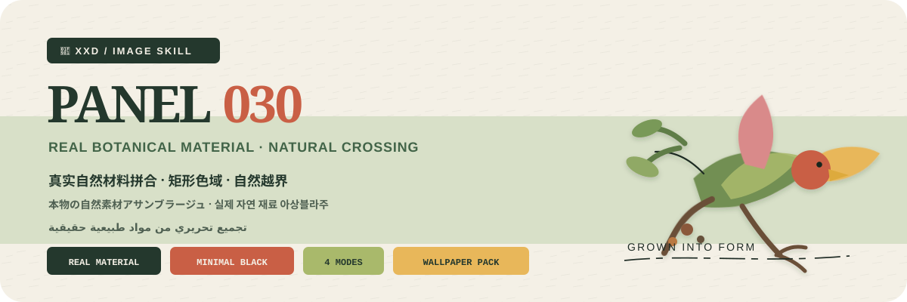
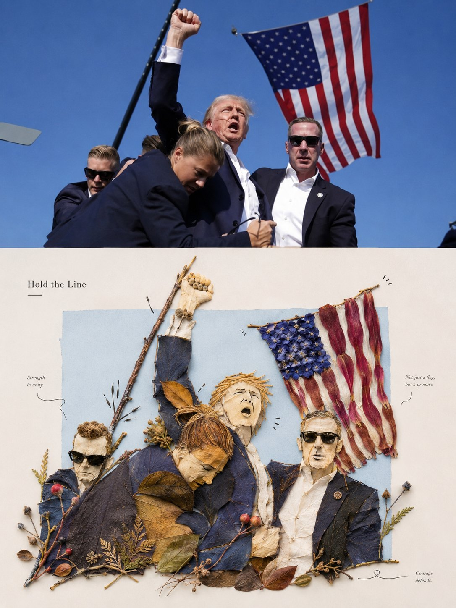
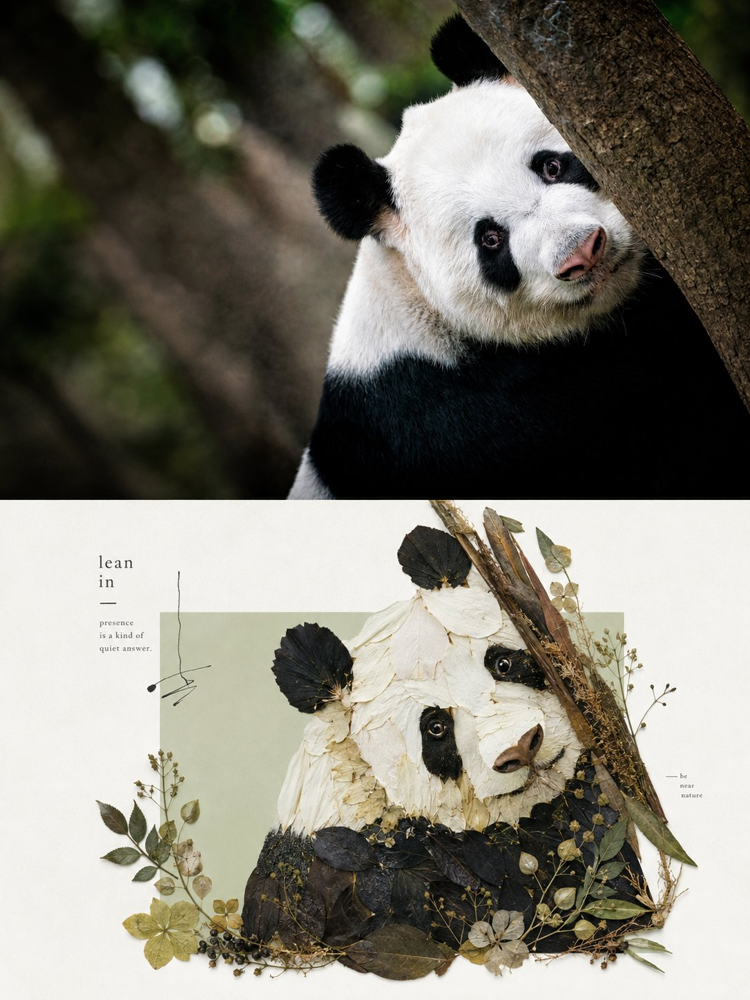

<p align="center">
  
</p>

<div align="center">

# 🦁 XXD Panel 030

### 用真实叶片、花瓣、枝条、果实、种子、草茎与树皮重构照片

[](./SKILL.md)
[](#四种输出共享同一种自然材料拼合逻辑)
[](#边界与信任)

<strong>简体中文</strong> · <a href="README.en.md">English</a> · <a href="README.ja.md">日本語</a> · <a href="README.ko.md">한국어</a> · <a href="README.ar.md">العربية</a>

</div>

> 真实自然材料 · 矩形色域 · 自然越界 · 极少黑线 · 编辑留白

XXD Panel 030 是一个面向 Codex 与兼容 Agent 的图像生成 Skill。它保留照片中真实的身份、比例、轮廓走势、姿态、方向、动作与关系，再用清晰可辨的真实叶片、花瓣、枝条、果实、种子、草茎、树皮或枯叶重构主体。

自然材料保留原本的形状、叶脉、纤维、透光、色差、卷曲、破损与不规则边缘。一块与当前源图协调的矩形色域建立秩序，但不画完整边框；主体大部分在内，只有真正具有方向感的一小段自然伸出。大量留白、不完全对称、极少黑线与轻量编辑文字，让自然材料的偶然性和版式纪律同时成立。

## 为什么需要 030

普通“树叶拼贴”很容易退化成儿童手工、现成花束、精准裁切的植物几何形，或把任意装饰误当成自然巧思。

030 的顺序完全相反：

```text
锁定身份／比例／走势／关系 → 选择能承担源图线索的真实自然形态 → 保留未经精准裁切的材质证据 → 建立一块无完整描边的源图协调矩形色域 → 主体大部分在内 → 只让真正有方向的一小段自然越界 → 平衡不完全对称与大量留白 → 只加入有功能的黑线和轻量编辑文字
```

如果换成一张无关照片，材料选择、主体轮廓、动作、矩形色域关系、自然越界、综合色彩和文字对齐仍然成立，这张图就不属于 030。

## 030 的视觉契约

- **源图身份：** 至少三个专属线索保住主体比例、轮廓走势、姿态、方向、动作、功能与关系。
- **真实自然形态：** 叶片、花瓣、枝条、果实、种子、草茎、树皮和枯叶必须看得出真实材质；它们原本的边缘与纹理直接建立主体，不是填进画好的轮廓。
- **一个矩形色域：** 色相、冷暖和明度与当前照片协调，以裁切或色差暗示边缘，不刻意画出完整四边。
- **源图决定越界：** 主体大部分在色域内部，只有原图动作或走势真正需要的一小段自然伸出。
- **黑线极少：** 细黑线只用于眼睛、表情、连接、动作暗示或短节奏，绝不为主体整体描边。
- **材料接触可信：** 真实叠压、尺度、卷曲和轻微接触影说明材料平放在承载面上，不变成贴纸或塑料假叶。
- **自然与编辑平衡：** 不完全对称、清晰重心、浅色背景和大量留白让画面鲜活但克制。
- **轻量文字：** 一个简短标题和必要的微型注释与色域边缘、留白或一根枝叶方向对齐。

## 样张 · 来自 X

> [小小东（@xiaoxiaodong01）](https://x.com/xiaoxiaodong01/status/2090464374188310979) · 2026-08-20<br>
> GPT2 x 植物 x 重构 x 美学提示词 x VOL.030

<table>
  <tr>
    <td width="50%"><a href="https://x.com/xiaoxiaodong01/status/2090464374188310979"></a></td>
    <td width="50%"><a href="https://x.com/xiaoxiaodong01/status/2090464374188310979"></a></td>
  </tr>
</table>

<p align="center"><a href="https://x.com/xiaoxiaodong01/status/2090464374188310979">查看原推文与完整提示词 →</a></p>

这些样张用于展示 030 的美学动机，不会把样张中的主体、构图、配色、文案或旧画幅变成生成参考或当前默认值。

## 原始提示词优先，而不是二次导演

`references/030-source.md` 是本项目唯一的创作与审美权威。Skill 不再额外总结或扩写它，也不会统一规划颜色、色板、美学动机、标题或微文案。原始提示词要求怎样处理颜色、材料、构图、留白与文字，GPT Image 2 就按那套逻辑执行。

模式与尺寸只覆盖原始提示词旧有的 3:4 上下双联容器：在左右模式中，“上方照片／下方设计”分别映射为左侧／右侧；在只要设计图和壁纸模式中，下方设计审美扩展到完整画布。除此之外，原始提示词全部保持有效。

## 原始提示词优先，而不是二次导演

`references/030-source.md` 是本项目唯一的创作与审美权威。Skill 不再额外总结或扩写它，也不会统一规划颜色、色板、美学动机、标题或微文案。原始提示词要求怎样处理颜色、材料、构图、留白与文字，GPT Image 2 就按那套逻辑执行。

模式与尺寸只覆盖原始提示词旧有的 3:4 上下双联容器：在左右模式中，“上方照片／下方设计”分别映射为左侧／右侧；在只要设计图和壁纸模式中，下方设计审美扩展到完整画布。除此之外，原始提示词全部保持有效。

## 原始提示词优先，而不是二次导演

`references/030-source.md` 是本项目唯一的创作与审美权威。Skill 不再额外总结或扩写它，也不会统一规划颜色、色板、美学动机、标题或微文案。原始提示词要求怎样处理颜色、材料、构图、留白与文字，GPT Image 2 就按那套逻辑执行。

模式与尺寸只覆盖原始提示词旧有的 3:4 上下双联容器：在左右模式中，“上方照片／下方设计”分别映射为左侧／右侧；在只要设计图和壁纸模式中，下方设计审美扩展到完整画布。除此之外，原始提示词全部保持有效。

## 原始提示词优先，而不是二次导演

`references/030-source.md` 是本项目唯一的创作与审美权威。Skill 不再额外总结或扩写它，也不会统一规划颜色、色板、美学动机、标题或微文案。原始提示词要求怎样处理颜色、材料、构图、留白与文字，GPT Image 2 就按那套逻辑执行。

模式与尺寸只覆盖原始提示词旧有的 3:4 上下双联容器：在左右模式中，“上方照片／下方设计”分别映射为左侧／右侧；在只要设计图和壁纸模式中，下方设计审美扩展到完整画布。除此之外，原始提示词全部保持有效。

## 原始提示词优先，而不是二次导演

`references/030-source.md` 是本项目唯一的创作与审美权威。Skill 不再额外总结或扩写它，也不会统一规划颜色、色板、美学动机、标题或微文案。原始提示词要求怎样处理颜色、材料、构图、留白与文字，GPT Image 2 就按那套逻辑执行。

模式与尺寸只覆盖原始提示词旧有的 3:4 上下双联容器：在左右模式中，“上方照片／下方设计”分别映射为左侧／右侧；在只要设计图和壁纸模式中，下方设计审美扩展到完整画布。除此之外，原始提示词全部保持有效。

## 四种可组合输出模式

模式可以单选或多选：`top-bottom`、`left-right`、`design-only`、`wallpaper-pack`。双联默认由图像模型一次生成完整画布；只有完整画布重试失败、要求原片逐像素不变或需要无损尺寸校准时，才使用拼合脚本兜底。

普通成品尺寸同样可以多选：自动适配、跟随原图、1:1、3:4、4:3、4:5、5:4、2:3、3:2、9:16、16:9、21:9、5:7、7:5，或自定义比例／准确像素。没有静默默认尺寸；每个不同比例都会基于同一份原始提示词独立重构。

壁纸套装可选“连贯”或“四张独立”。连贯模式先生成一张定调图，其余设备同时参考原图与定调图重新构图；不会把一张图机械裁成四种尺寸。

## 文字方式

正式生图前只确认三种选择：

1. **模型根据原始提示词生成文字**：用户只指定语言或地区，文字内容、数量、气质与排版由 GPT Image 2 按原始提示词生成。
2. **使用我的准确文字**：逐字传给图像模型，不改写、不翻译、不补标题；排版仍遵循原始提示词。
3. **不要文字**：严格禁止文字与伪文字。

外层 Skill 不再预编标题、微文案或文案包。文字语言与操作语言分开确认，不根据人物、场景或文件名猜测国家与受众。

## 完整画布优先与位图边界

图像模型负责整张成品的审美重构，双联也默认一次直出完整画布。`scripts/compose_panel.py` 只保留为条件明确的兜底、无创尺寸校准和只读审计工具，不再预先规划每次任务，也不评价审美是否成功。

全部交付为 PNG 位图。每次调用都在 `~/Desktop/xxd/` 下创建新任务；已配置图像通道只返回脱敏状态，不公开供应商、端点、凭据、请求头、提示词、响应或账户信息。SVG、HTML、Canvas、图表和程序绘图不能替代最终作品。

## 勾选式选择与快捷参数

当运行环境提供真正的交互控件时，Skill 会优先使用卡片式选择：成品模式和普通成品尺寸均可多选，文字方式与壁纸关系为单选。尺寸提供自动适配、跟随原图、1:1、3:4、4:3、4:5、5:4、2:3、3:2、9:16、16:9、21:9、5:7、7:5 和自定义比例／像素。没有交互控件时，会自动改用清楚的多行编号菜单，不显示无法点击的假复选框。

所有设置也可以作为变量直接跟在调用指令后：

```text
/xxd-panel-030 photo.jpg --mode top-bottom,design-only --size auto,3:4,9:16 --text prompt --locale ja-JP
```

可使用 `--mode`、可重复或逗号分隔的 `--size`、`--text prompt|exact|none`、`--locale`、`--copy`、`--wallpaper linked|independent`、`--wallpaper-size` 和 `--out`。参数齐全时跳过全部问询并直接生成；参数不完整时只补问缺失项。不同比例会分别重新构图，四端壁纸仍是独立设备分支，不与普通尺寸机械相乘。

## 生图模型优先级

GPT Image 2 是默认首选，并继续执行本项目现有的高保真垫图、生成前确认整张画幅、双联一次生成完整画布、脚本仅作条件式兜底等逻辑。

当当前工具或已配置兼容通道确实可用，并能满足原图保真、整张成品比例、目标语言文字和连贯壁纸多图参考等要求时，也支持 Seedance 5.0 Pro、Nano Banana Pro（Gemini Image Pro）、Nano Banana 2（Gemini Image Flash）或其他兼容位图模型。备用模型只替换生成通道，不得改变模式、画幅、文案、语言、壁纸关系和完整画布优先策略。

如果没有合适的生图通道，Skill 会请用户启用生图工具或提供 API Key。用户主动提供的凭据可以用于当前任务，但不得在回复或日志中回显、展示或泄露；未经用户明确要求，不会长期保存凭据或修改供应商、账户、计费及全局路由配置。

## 开始使用

```bash
git clone https://github.com/nevertoday/xxd-panel-030.git
mkdir -p ~/.codex/skills
ln -s "$(pwd)/xxd-panel-030" ~/.codex/skills/xxd-panel-030
```

Claude Code 用户可以把同一目录链接到 `~/.claude/skills/xxd-panel-030`。安装后重新启动 Agent 会话。

```text
$xxd-panel-030
把这张照片做成左右双联，文案由你根据照片内涵创作，使用自然韩语。
```

只上传照片也可以调用。Skill 会先用分行编号菜单询问一个或多个模式，再询问文字设置；选择壁纸时还会确认连贯或独立以及设备尺寸。

完整规范：

- [Skill 工作流](SKILL.md)
- [中文运行适配器](references/xxd-panel-030-prompt.zh-CN.md)
- [英文运行适配器](references/xxd-panel-030-prompt.en.md)
- [原始风格提示词](references/030-source.md)

## 边界与信任

- 每张照片只在自己的任务中使用，不借用其他输入、旧成品或样张里的主体、颜色、文案和构图。
- 每次调用都创建新的任务子文件夹；相同原图和参数也要重新生成，旧成品不能冒充当前任务。
- 最终交付为 PNG 位图，不是 SVG、HTML、Canvas 或程序绘图替代品。
- 已配置位图桥接只返回脱敏状态，不显示供应商、端点、请求头、凭据、提示词或服务器响应正文。
- 每个所选普通模式各返回一张；若选择 `wallpaper-pack`，再返回四张独立壁纸。选择 `全部` 时每张原图共返回 7 个 PNG，分处四个同级模式文件夹，绝不生成拼贴总览。

本地拼版需要 Python 3 和 Pillow。安全位图桥接使用 Python 3.11+ 的 `tomllib`。图像生成仍需要主机 Agent 的内置位图能力或已经配置好的兼容位图路径。

## 项目结构

```text
xxd-panel-030/
├── SKILL.md
├── README.md / README.en.md / README.ja.md / README.ko.md / README.ar.md
├── agents/openai.yaml
├── assets/
│   ├── banner.svg
│   └── examples/（未来本地样张占位）
├── scripts/
│   ├── compose_panel.py
│   └── configured_imagegen.py
└── references/
    ├── xxd-panel-030-prompt.zh-CN.md
    ├── xxd-panel-030-prompt.en.md
    └── 030-source.md
```

## 关于 XXD

XXD 是小小东的品牌名称缩写。项目由 [@xiaoxiaodong01](https://x.com/xiaoxiaodong01) 创建并维护。

## 服务与会员

### 深度咨询 · 299 元/小时

Skills 使用的一对一深度咨询按 299 元/小时收费。请通过下方微信二维码联系小小东预约。

### 小小东 Skills 用户交流群 · 入群 99 元

一次支付 99 元加入用户交流群，用于交流工作流、作品与互助；不包含按小时的一对一深度咨询。扫码后请备注“Skills 用户交流群”。

### 知识星球＋成员提示词库 · 699 元/年

[知识星球](https://wx.zsxq.com/group/15554814142882)与[小小东成员提示词库](https://vip.xiaoxiaodong.ai/)是同一份会员权益：**一次年费同时开通两边，无需重复付费。**

1. 在[知识星球](https://wx.zsxq.com/group/15554814142882)开通后，微信联系小小东领取成员提示词库兑换码。
2. 在[成员提示词库](https://vip.xiaoxiaodong.ai/)自助开通后，微信联系小小东邀请进入知识星球。

<p align="center">
  <a href="https://xiaoxiaodong.pages.dev/assets/wechat-qr.png"></a>
</p>

<div align="center">

**让自然提供形状，让版面提供巧思。**

</div>

---

<div align="center">
  <h2>☕ 为开源项目赞助算力</h2>
  <p>如果这个项目为你节省了时间，可以通过微信或支付宝赞助后续测试与生成算力。</p>
  <table>
    <tr>
      <td align="center" width="240">
        <a href="https://colors.xiaoxiaodong.ai/docs/images/wechat-reward-qr.png"></a><br>
        <strong>微信算力赞助</strong>
      </td>
      <td align="center" width="240">
        <a href="https://colors.xiaoxiaodong.ai/docs/images/alipay-reward-qr.png"></a><br>
        <strong>支付宝算力赞助</strong>
      </td>
    </tr>
  </table>
  <p><sub>赞助完全自愿，不会改变这个开源项目的使用权限。</sub></p>
</div>
